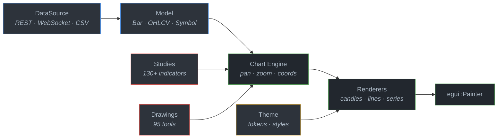

<div align="center">

# egui-charts

**Production-grade financial charting engine for [egui](https://github.com/emilk/egui).**

[](https://github.com/userFRM/egui-charts/actions)
[](https://crates.io/crates/egui-charts)
[](https://docs.rs/egui-charts)
[](#license)
[](#minimum-supported-rust-version)

[Live Demo](https://userfrm.github.io/egui-charts/) · [API Docs](https://docs.rs/egui-charts) · [Examples](https://github.com/userFRM/egui-charts/tree/main/examples)

<!--  -->

</div>

---

20 chart types. 95 drawing tools. 130+ technical indicators. Full design-token theme system. Pure Rust — compiles to native and WebAssembly with zero JavaScript dependencies.

---

## When This Is Useful

- **You need TradingView-quality charts inside an egui application** — candlesticks, OHLC, Heikin-Ashi, Renko, Kagi, Market Profile, and 14 more chart types out of the box.
- **You're building a Tauri desktop trading terminal** — designed as a drop-in rendering engine with toolbar, panel, and dialog UI behind a feature flag.
- **You want interactive drawings and indicators** — 95 drawing tools with undo/redo, magnet snapping, and persistence; 130+ indicators with a uniform trait interface.
- **You need a themeable, token-driven design system** — five presets (Classic, Dark, Light, Midnight, High Contrast) backed by a RON-based token pipeline.
- **You want one codebase for desktop and web** — the same `Chart` widget renders natively on Linux/macOS/Windows and in the browser via WebAssembly.

---

## Architecture



<details>
<summary><strong>Module map</strong></summary>

```
egui-charts/src/
├── chart/                     Rendering engine, pan/zoom, hit-testing, series, overlays
│   ├── builder.rs             ChartBuilder fluent API + TradingChart runtime wrapper
│   ├── renderers/             Per-chart-type rendering (candles, renko, kagi, footprint…)
│   ├── coords/                Coordinate mapping (chart ↔ screen space)
│   ├── pan_zoom.rs            Smooth pan/zoom with kinetic scrolling, elastic bounce
│   ├── indicators/            Indicator pane rendering and layout
│   └── series/                Series data management and rendering dispatch
├── drawings/                  95 drawing tools with full interaction lifecycle
│   ├── domain/                Pure types: DrawingToolType, Drawing, ChartPoint, options
│   ├── services/              Selection, undo/redo (command pattern), snapping, z-ordering
│   ├── rendering/             Category-specific renderers (lines, fibonacci, patterns…)
│   └── persistence.rs         JSON serialization for save/load
├── studies/                   130+ technical indicators
│   ├── builtin/               All indicator implementations
│   ├── factory.rs             IndicatorFactory — dynamic creation by name
│   ├── indicator_trait.rs     Core Indicator trait and IndicatorValue enum
│   └── custom.rs              Runtime indicator creation with closures
├── model/                     Domain types: Bar, BarData, Symbol, Timeframe, ChartType
├── scales/                    Price scales (linear, log, %), time scales, formatters
├── config/                    ChartConfig, ChartOptions, crosshair, tooltip, keyboard
├── data.rs                    DataSource trait — pluggable data provider interface
├── validation/                OHLC integrity checks, timestamp ordering
├── theme/                     Theme system: presets, semantic tokens, component styles
├── tokens/                    RON-based design tokens (colors, spacing, typography)
├── styles/                    Style computation from semantic tokens
├── widget/                    Chart egui widget, indicator panes
├── icons/                     280+ compile-time embedded SVG icons
├── ext/                       UiExt, ContextExt, ResponseExt, HasDesignTokens
├── ui/          [feature: ui] Toolbars, panels, dialogs, replay controls
├── ui_kit/      [feature: ui] Reusable widget library: buttons, forms, color pickers
├── backtest/    [feature: backtest] Strategy backtesting
└── scripting/   [feature: scripting] User-defined indicators and strategies
```

</details>

---

## Quick Start

Add the dependency:

```toml
[dependencies]
egui-charts = "0.1"
```

Create a chart in your egui app:

```rust
use egui_charts::{ChartBuilder, Chart};
use egui_charts::model::Timeframe;
use egui_charts::theme::Theme;

// Build a chart with the fluent API
let mut chart = ChartBuilder::new()
    .with_symbol("BTCUSDT")
    .with_timeframe(Timeframe::H1)
    .with_theme(Theme::dark())
    .with_drawing_tools()
    .build();

// In your egui update loop:
fn update(&mut self, ctx: &egui::Context, _frame: &mut eframe::Frame) {
    egui::CentralPanel::default().show(ctx, |ui| {
        self.chart.update();     // poll data, progressive loading
        self.chart.show(ui);     // render the chart
    });
}
```

For a minimal price sparkline (no grid, no crosshair, no tools):

```rust
let mini = ChartBuilder::price_chart()
    .with_symbol("ETHUSDT")
    .with_visible_candles(30)
    .build();
```

---

## Builder Presets

| Constructor | Use Case |
|---|---|
| `ChartBuilder::new()` | Sensible defaults, auto-fetch 1000 bars |
| `ChartBuilder::extended()` | Full trading terminal with drawings + indicators |
| `ChartBuilder::price_chart()` | Minimal sparkline / dashboard widget |
| `ChartBuilder::options_chart()` | Non-time-based displays (options chains) |

---

## Feature Flags

| Feature | Default | Description |
|---|:---:|---|
| `icons` | **on** | 280+ compile-time embedded SVG icons. Required by `ui`. Disable with `default-features = false` to save binary size. |
| `ui` | off | Application-level UI: drawing toolbar, top toolbar, timeframe bar, replay controls, sidebars, dialogs, and the `ui_kit` widget library. |
| `backtest` | off | Strategy backtesting on historical data. |
| `scripting` | off | Embedded scripting for user-defined indicators and strategies. |

```toml
# Core chart only (default)
egui-charts = "0.1"

# Full trading terminal UI
egui-charts = { version = "0.1", features = ["ui"] }

# Everything
egui-charts = { version = "0.1", features = ["ui", "backtest", "scripting"] }
```

---

## Chart Types

20 chart types across 6 categories:

| Category | Types |
|---|---|
| **Standard** | Candlesticks · OHLC Bars · Hollow Candles · Volume Candles |
| **Line** | Line · Line with Markers · Step Line |
| **Area** | Area · HLC Area · Baseline |
| **Japanese** | Heikin-Ashi · Renko · Kagi · Line Break · Point & Figure |
| **Range** | High-Low · Range Bars |
| **Advanced** | Volume Footprint · TPO / Market Profile · Session Volume |

---

## Drawing Tools

95 tools organized into 8 toolbar categories:

| Category | Examples | Count |
|---|---|:---:|
| **Cursors** | Cross, Dot, Arrow, Eraser | 4 |
| **Lines** | Trend Line, Ray, Horizontal/Vertical, Channels, Pitchforks | 17 |
| **Fibonacci** | Retracement, Extension, Channel, Time Zones, Circles, Spiral, Wedge | 15 |
| **Patterns** | XABCD, Cypher, Head & Shoulders, Elliott Waves, Cycles | 14 |
| **Projection** | Long/Short Position, Forecast, Anchored VWAP, Volume Profile | 12 |
| **Shapes** | Brush, Highlighter, Rectangle, Circle, Ellipse, Polyline, Arc | 16 |
| **Annotations** | Text, Note, Callout, Comment, Price Label, Signpost, Table, Image | 14 |
| **Icons** | Font Icon / Emoji | 1 |

All drawings persist in chart coordinates (bar index + price) and survive pan/zoom. Undo/redo, multi-select, magnet snapping, and JSON serialization are built in.

---

## Technical Indicators

130+ built-in indicators implementing a uniform `Indicator` trait.

| Category | Indicators |
|---|---|
| **Moving Averages** | SMA, EMA, WMA, DEMA, TEMA, HMA, ALMA, VWMA, LSMA, SWMA, KAMA, VIDYA, McGinley Dynamic, and more |
| **Momentum** | RSI, MACD, Stochastic, Williams %R, CCI, ROC, Aroon, Awesome Oscillator, Ultimate Oscillator, Connors RSI, TRIX, KDJ |
| **Trend** | ADX, SuperTrend, Ichimoku Cloud, Parabolic SAR, Directional Movement, Vortex, Squeeze Momentum |
| **Volatility** | Bollinger Bands, ATR, Keltner Channels, Donchian Channels, Historical Volatility, Chandelier Exit |
| **Volume** | OBV, VWAP, MFI, A/D, CMF, Volume ROC, Klinger Oscillator, CVD, Volume Profile |
| **Support** | Pivot Points, ZigZag, Price Channel |
| **Statistics** | Correlation, Linear Regression, Standard Error, Rank Correlation |

```rust
use egui_charts::studies::{Indicator, IndicatorRegistry, SMA, RSI, BollingerBands};

let mut registry = IndicatorRegistry::new();
registry.add(Box::new(SMA::new(20)));
registry.add(Box::new(RSI::new(14)));
registry.add(Box::new(BollingerBands::new(20, 2.0)));
registry.calculate_all(&bars);
```

---

## Custom Data Sources

Implement `DataSource` to connect any market data provider:

```rust
use egui_charts::data::{DataSource, DataSourceError, DataUpdate, HistoricalDataRequest};
use egui_charts::model::{Bar, Timeframe};

struct MyBrokerData { /* ... */ }

impl DataSource for MyBrokerData {
    fn fetch_historical(&self, req: &HistoricalDataRequest)
        -> Result<Vec<Bar>, DataSourceError>
    {
        // Fetch from your API, database, CSV, etc.
        todo!()
    }

    fn subscribe(&mut self, symbol: &str, timeframe: Timeframe) { /* ... */ }
    fn unsubscribe(&mut self, symbol: &str) { /* ... */ }
    fn poll(&mut self) -> Option<DataUpdate> { /* ... */ }
}
```

---

## Theme System

Five built-in presets backed by a RON-based design-token pipeline:

**RON design tokens** → **semantic tokens** (light/dark resolved) → **component styles** → **egui visuals**

| Preset | UI Chrome | Chart Background |
|---|---|---|
| **Classic** (default) | Light | Dark |
| **Dark** | Dark | Dark |
| **Light** | Light | Light |
| **Midnight** | Dark (blue) | Dark |
| **High Contrast** | Dark | Dark |

```rust
use egui_charts::theme::{Theme, ThemePreset, apply_to_egui};

let theme = Theme::from_preset(ThemePreset::Midnight);
apply_to_egui(ctx, &theme);

// Or use convenience constructors
let theme = Theme::dark();
let theme = Theme::high_contrast();
```

Access chart colors anywhere via the `HasDesignTokens` extension trait on `egui::Ui`.

---

## Tauri Integration

`egui-charts` is designed as the rendering engine for [Tauri](https://tauri.app) desktop applications.

```toml
[dependencies]
egui-charts = { version = "0.1", features = ["ui"] }
```

```rust
fn update(&mut self, ctx: &egui::Context, _frame: &mut eframe::Frame) {
    let theme = Theme::dark();
    apply_to_egui(ctx, &theme);

    egui::CentralPanel::default().show(ctx, |ui| {
        self.chart.update();
        self.chart.show(ui);
    });
}
```

1. **Add the dependency** with the `ui` feature for toolbar and panel support.
2. **Implement `DataSource`** to bridge your Tauri backend (IPC or WebSocket) to the chart's data layer.
3. **Create a `ChartBuilder`** in your `eframe::App::update` and call `chart.show(ui)`.
4. **Apply a theme** at startup with `apply_to_egui()` to propagate design tokens.

---

## Interaction

| Input | Behavior |
|---|---|
| Click + drag | Pan the chart |
| Scroll wheel / pinch | Zoom in and out |
| Shift + drag | Box zoom |
| Crosshair | Syncs across multiple panes |
| Keyboard | Configurable via `KeyboardOptions` |

Kinetic scrolling with momentum-based panning and elastic bounce at edges. Real-time streaming via `chart.update_data()` with auto-scroll.

---

## Platform Support

| Target | Status |
|---|---|
| Linux (x86_64, aarch64) | Supported |
| macOS (x86_64, aarch64) | Supported |
| Windows (x86_64) | Supported |
| WebAssembly (wasm32) | Supported — `wasm-bindgen` + `web-sys` |

---

## Minimum Supported Rust Version

The MSRV is **1.88** (Rust edition 2024), enforced in `Cargo.toml` via `rust-version`.

---

## License

Licensed under either of

- [Apache License, Version 2.0](LICENSE-APACHE)
- [MIT License](LICENSE-MIT)

at your option.

## Contributing

Contributions are welcome. Unless you explicitly state otherwise, any contribution intentionally submitted for inclusion in the work by you, as defined in the Apache-2.0 license, shall be dual licensed as above, without any additional terms or conditions.
